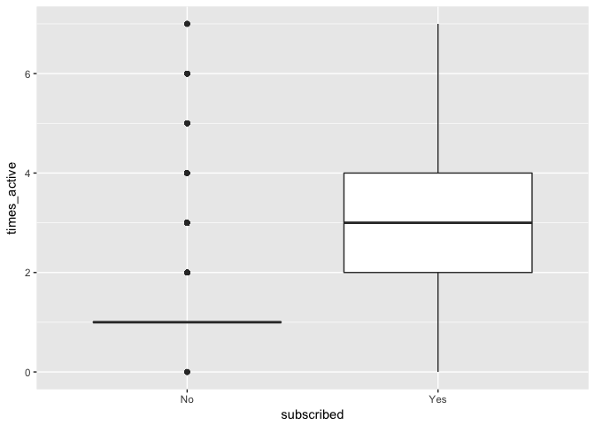
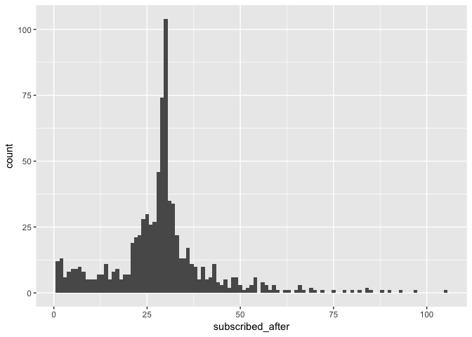
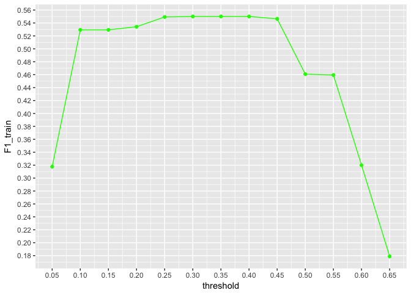

FreeAgent Data Analysis Task (Continuation)
================
Nil Molne
22 May 2017

Introduction
------------

The goal of this FreeAgent's Data Analysis Task is to build a model to predict at day 7 whether a customer is going to subscribe by the end of the free trial period. We are given two data sets for the date range of 2017-01-01 through 2017-03-31 with information in different formats comprising signups and activity logs.

The libraries I will be using are the following:

``` r
library(dplyr)
library(ggplot2)
library(caret)
library(pROC)
```

Reading the Data
----------------

The following lines will load in the data from the files provided.

``` r
activity <- read.table('activity.txt', header = FALSE)
signups <- read.csv('signups.csv', header = TRUE)
```

Data Preparation
----------------

Once the data is loaded into R dataframes, I check for missing values.

``` r
sum(is.na(signups))
```

    ## [1] 898

``` r
sum(is.na(activity))
```

    ## [1] 0

The **signups** dataframe contains 898 missing values. It is not possible to impute the missing values based on other attributes from the different entries because some crucial information is missing (i.e. the **company\_id**). Therefore, all rows containing NAs will be removed. Furthermore, non useful columns from the activity dataframe will also be dropped.

``` r
sdata <- subset(signups, company_id != 'NA')
adata <- subset(activity, select = -c(V1, V3, V4, V5))
adata <- setNames(adata, c('company_id', 'active_on'))
```

Some data manipulation...

``` r
#Set the prediction day to 7
prediction_day <- 7

#Create a categorical variable for subscription state
adata$active_on <- as.POSIXct(adata$active_on, "%Y-%m-%d")
sdata <- mutate(sdata, subscribed = ifelse(subscribed_on != '', 'Yes', 'No'))

#Since day zero of a free trial starts at 00:00 on the day of the activation, I can get rid of the specific times.
sdata$signup_at <- substring(sdata$signup_at, 1, 10)
sdata$signup_at <- as.POSIXct(sdata$signup_at, "%Y-%m-%d")
sdata$activated_at <- substring(sdata$activated_at, 1, 10)
sdata$activated_at <- as.POSIXct(sdata$activated_at, "%Y-%m-%d")

#Delete companies which signed up before prediction_day
sdata_temp <- sdata
for(i in 1:dim(sdata[1])[1]){
  
  if(sdata[i, 'subscribed'] == 'Yes'){
    if(difftime(as.POSIXct(sdata[i, 'subscribed_on'], "%Y-%m-%d"), sdata[i, 'activated_at']) >= prediction_day){
      sdata_temp <- sdata_temp[-c(i), ] #guardar index i per esborrar despres
    }
  }
  
}
sdata <- sdata_temp
```

Exploratory Data Analysis/Feature Selection
-------------------------------------------

First, I check what's the balance of customers that ended up subscribing.

``` r
percentage <- prop.table(table(sdata$subscribed)) * 100
cbind(freq = table(sdata$subscribed), percentage = percentage)
```

    ##     freq percentage
    ## No  4702   84.56835
    ## Yes  858   15.43165

Only the **15.44%** in the sampled customers subscribed by the end of the trial period.

I also check whether different company types lead to different subscription rates:

``` r
sdata %>% group_by(company_type) %>% summarize(subscribtion_rate = sum(subscribed == 'Yes')/n())
```

    ## # A tibble: 10 <U+00D7> 2
    ##                        company_type subscribtion_rate
    ##                              <fctr>             <dbl>
    ## 1                UK Limited Company        0.19712690
    ## 2  UK Limited Liability Partnership        0.15625000
    ## 3                    UK Partnership        0.14876033
    ## 4                    UK Sole Trader        0.16042447
    ## 5                         US C Corp        0.05555556
    ## 6      US Limited Liability Company        0.11206897
    ## 7                    US Partnership        0.07142857
    ## 8                         US S Corp        0.14814815
    ## 9                US Sole Proprietor        0.04861111
    ## 10                        Universal        0.06100478

It is remarkable that roughly all non-UK companies ('US C Corp', 'US Partnership', 'US Sole Proprietor' and 'Universal') have subscription rates lower than 10% unlike the rest. Hence, **company\_type** can be a useful feature to add to the model as a first variable.

Another potential feature to include in is the activity count from the day that a company activated the trial through the prediction day. I create that new variable as follows:

``` r
#Times active within prediction_day after activation
sdata <- mutate(sdata, times_active = 0)

for(i in 1:dim(adata[1])[1]){
  
  company_id <- adata$company[i]
  #Check if the company in adata shows up in signups
  if(length(which(sdata$company_id == company_id)) == 0){
    next
  }
  
  active_on <- adata$active_on[i]
  activated_at <- sdata[sdata$company_id == company_id, 'activated_at']
  if((difftime(active_on, activated_at, units = "days") < prediction_day)){
    sdata[sdata$company_id == company_id, 'times_active'] <- sdata[sdata$company_id == company_id, 'times_active'] + 1
  }
  
}
```

I check if this new variable (**times\_active**) is a potential good feature to include in our model with the following box plot:

``` r
ggplot(aes(x = subscribed, y = times_active), data = sdata) + geom_boxplot() 
```



Noticeably, those customers who ended up subscribing have a median activity of 5 whereas those who didn't have it lowered to 1. Therefore, this is going to be the second feature to include in the model.

In addition, I have also checked the time between sign up and activation but it did not appear to be a good distinguishing feature between subscribers and non subscribers.

Model Selection
---------------

I first create a data partition (80%-20%) for training/selecting the model and finally evaluating the best performing one with the validation dataset.

``` r
validation_index <- createDataPartition(sdata$subscribed, p = 0.80, list = FALSE)
validationdata <- sdata[-validation_index, ]
traindata <- sdata[validation_index, ]
```

Given that the classes are **imbalanced** (there are many more negative subscriptions than positives), it is important to notice that accuracy will not be an appropriate measure to evaluate how well the model does.

Rather, I will use ROC as the metric for both finding the best parameters within each classifier during the training as well as for comparing the classifiers to one another.

The chosen training pattern will be a cross-validated 10 fold with 10 repeats.

``` r
#Make sure 'Yes' will be the positive class
validationdata$subscribed <- ordered(validationdata$subscribed, levels = c("Yes", "No"))
traindata$subscribed <- ordered(traindata$subscribed, levels = c("Yes", "No"))

#Assign training properties
metric <- 'ROC'
control <- trainControl(method = 'cv', number = 10,
                        repeats = 10,
                        verboseIter = FALSE,
                        classProbs = TRUE,
                        summaryFunction = twoClassSummary)
```

To have a good spectrum of classifiers covered I evaluate linear (Logistic Regression) and non linear (NN, CART, SVM and RF) models. I train all models mentioned above with the two predictors (in lack of more features) discussed in the EDA section of this task.

``` r
#set.seed(10)
#fit.model_glm <- train(factor(subscribed) ~ times_active + factor(company_type), data = #traindata, method = 'glm', metric = metric, trControl = control)

set.seed(10)
fit.model_nnet<- train(factor(subscribed) ~ times_active + factor(company_type), data = traindata, method = 'nnet', metric = metric, trControl = control, trace = FALSE)

#set.seed(10)
#fit.model_rpart <- train(factor(subscribed) ~ times_active + factor(company_type), data = #traindata, method = 'rpart', metric = metric, trControl = control)

#set.seed(10)
#fit.model_svmradial <- train(factor(subscribed) ~ times_active + factor(company_type), #data = traindata, method = 'svmRadial', metric = metric, trControl = control)

#set.seed(10)
#fit.model_rf <- train(factor(subscribed) ~ times_active + factor(company_type), data = #traindata, method = 'rf', metric = metric, trControl = control)
```

I then compare the results of all classifiers fit with the training dataset.

``` r
#model_results <- resamples(list(glm = fit.model_glm, nnet = fit.model_nnet, rpart = #fit.model_rpart, svmradial = fit.model_svmradial, rf = fit.model_rf))

#summary(model_results)
#dotplot(model_results, metric = 'ROC')
```

It seems that the algorithm that scored the best mean AUC was the Neural Network. Hence, the classifier considered for further exploration will be the Neural Network. Details about the composition of the NN chosen can be found running 'print(fit.model\_nnet)'.

As a next step, now that I know which classifier best copes with the natural training data, I will try improving its performance by using some of the most common methods to overcome the negative effects of class imbalance over the classifier. Such techniques will be: i. Assigning class weights, ii. Down-sampling, iii. Up-sampling, and iv. Synthetic minority sampling technique (SOMTE).

``` r
model <- 'nnet'

#set.seed(10)
#model_weights <- ifelse(traindata$subscribed == 'Yes', (1/table(traindata$subscribed)[1]) * 0.5, (1/table(traindata$subscribed)[2]) * 0.5)

#fit.model_weights <- train(factor(subscribed) ~ times_active + factor(company_type), data = traindata, method = model, weights = model_weights, metric =  metric, trControl = control, trace = FALSE)

#set.seed(10)
#control$sampling <- "down"
#fit.model_down <- train(factor(subscribed) ~ times_active + factor(company_type), data = #traindata, method = model, metric = metric, trControl = control, trace = FALSE)

#control$sampling <- "up"
#fit.model_up <- train(factor(subscribed) ~ times_active + factor(company_type), data = #traindata, method = model, metric = metric, trControl = control, trace = FALSE)

#set.seed(10)
#control$sampling <- "smote"
#fit.model_smote <- train(factor(subscribed) ~ times_active + factor(company_type), data = #traindata, method = model, metric = metric, trControl = control, trace = FALSE)
```

As we first did for choosing the classifier, I am now going to compare how the different techniques apply to the Neural Network classifier judging by the change in AUC from the imbalanced classifier.

``` r
#balanced_results <- resamples(list(imbalanced = fit.model_nnet, undersampling = fit.model_down, oversampling = fit.model_up, smote = fit.model_smote, weights = fit.model_weights))
#summary(balanced_results)
#dotplot(balanced_results, metric = 'ROC')
```

It seems that the class balancing techniques did not enhance substantially the AUC score for the NN model (**and none of the other classifiers, which was also checked**). However, there actually was a very little improvement by using weights on the training. Therefore, **the chosen model will be a NN with weights**.

Finally, to complete the model selection, it is important to choose a cutoff threshold for the classifier that goes accordingly with the company's goals. In the event that FreeAgent is looking for evaluating at day 7 the success of their marketing campaigns by checking how likely free trials are to convert to paid subscriptions, then I believe it is more convenient to choose a model which best generalizes the data (**best** **AUC**), or in other words, a cutoff threshold that leads to the **highest** **specificity** and **highest** **sensitivity** possible.

On the other hand, a threshold taking into account only the **highest** **possible** **specificity** would allow FreeAgent to correctly capture the vast majority of negative cases. Accordingly, FreeAgent would be able to launch more aggressive and specifically targeted marketing campaigns to those customers that are potentially not going to subscribe by the end of the trial period. In other words, strive to not letting them go easily. Yet, we would have to give up some sensitivity.

Model Performance
-----------------

I will now measure the model's performance with previously unseen data (the validation dataset) by using the previously chosen model in the section above.

*Please note that the output parameters given by the Caret confusionMatrix() function such as the Kappa statistic, F1 measure, Accuracy, Sensitivity or Specificity,... are threshold dependent and the results shown assume a default 0.5 cutoff threshold. Since, as discussed, the threshold will depend on the company specific needs, I will stick to AUC to report the performance on the unseen data*

``` r
#Make the prediction
#predictions.model_weights <- predict(fit.model_weights, validationdata, type = 'prob')

#Compute AUC for the model on validation set
#pROC::roc(ifelse(validationdata[,'subscribed'] == "Yes", 1, 0), predictions.model_weights[[2]])$auc
```

When dealing with new data, the classifier does nearly as well as with the training data. That would mean that there are **no symptoms of high variance**.

Conclusions
-----------

The AUC score of the proposed model is reasonable taking into account that only two predictors were used. However, in my opinion, it is this lack of predictors which does not help to achieve a greater performance to the model. More predictors such as more in depth information of each activity, as well as time per activity and more time resolution between activities to compute the average time between activities, would definitely help to figure out more patterns to discriminate between subscribers and non-subscribers, and hence construct a better performing model. On the top of that, it is also worth mentioning that surprisingly, the alternative sampling techniques to deal with class imbalance do not have any relevant positive effect on the performance. It would be a good practice to check whether when adding more features to the model, the various techniques change the performance more significantly.

PART II: CONTINUATION
---------------------

7 New Features (or predictors) for improving the classification performance
---------------------------------------------------------------------------

Each variable represents whether a company was active given a single day from activation through *prediction\_day*.

``` r
#Initialize as 'No' every day analysed
sdata <- mutate(sdata, active_day1 = 'No')
sdata <- mutate(sdata, active_day2 = 'No')
sdata <- mutate(sdata, active_day3 = 'No')
sdata <- mutate(sdata, active_day4 = 'No')
sdata <- mutate(sdata, active_day5 = 'No')
sdata <- mutate(sdata, active_day6 = 'No')
sdata <- mutate(sdata, active_day7 = 'No')

for(i in 1:dim(adata[1])[1]){
  
  company_id <- adata$company[i]
  #Check if the company in adata shows up in signups
   #if 'which()' returns an index, the company exists and length != 0
   #if it returns an integer(0), there is no such company and length = 0
  if(length(which(sdata$company_id == company_id)) == 0){
    next
  }
  
  #Check whether the acticity was within any of the first 'prediction_day' days
  active_on <- adata$active_on[i]
  activated_at <- sdata[sdata$company_id == company_id, 'activated_at']
  if((difftime(active_on, activated_at, units = "days") < prediction_day)){
    
    day_active <- difftime(active_on, activated_at, units = "days")
    
    if(day_active == 0){
      sdata[sdata$company_id == company_id, 'active_day1'] <- 'Yes'
    }
    
    if(day_active == 1){
      sdata[sdata$company_id == company_id, 'active_day2'] <- 'Yes'
    }
    
    if(day_active == 2){
      sdata[sdata$company_id == company_id, 'active_day3'] <- 'Yes'
    }
    
    if(day_active == 3){
      sdata[sdata$company_id == company_id, 'active_day4'] <- 'Yes'
    }
    
    if(day_active == 4){
      sdata[sdata$company_id == company_id, 'active_day5'] <- 'Yes'
    }
    
    if(day_active == 5){
      sdata[sdata$company_id == company_id, 'active_day6'] <- 'Yes'
    }
    
    if(day_active == 6){
      sdata[sdata$company_id == company_id, 'active_day7'] <- 'Yes'
    }
    
  }
}
```

Average days that took a subscribing customer to subscribe after activation Note that it is not a valid feature for the model since it is passed the 7th day

``` r
for(i in 1:dim(sdata)[1]){
  if(sdata[i, "subscribed"] == 'Yes'){
    sdata[i, 'subscribed_after'] <- difftime(sdata[i, "subscribed_on"], sdata[i, "activated_at"], units = 'days')
    sdata[i, 'subscribed_after'] <- round(sdata[i, 'subscribed_after'])
    }
}
```

Distribution of days to subscription

``` r
#Delete the outliner 'subscribed_after'
ggplot(subset(sdata, subscribed_after > 0), aes(x = subscribed_after)) + 
  geom_histogram(binwidth = 1)
```



Average days to subscription

``` r
sdata %>% filter(subscribed_after > 0) %>% summarise(Average_days_to_subscription = sum(subscribed_after)/n())
```

    ##   Average_days_to_subscription
    ## 1                     28.57247

Choosing the best threshold
---------------------------

So far I've found the best model according to the AUC score on the training set. But how does the model perform when choosing specific thresholds over the training set and checking it on the test?

F1 is a good parameter to select the threshold which best generalizes the data. F1 it is a weighted average of 'specificity' and 'sensitivity' which ranges from 0 to 1. The higher F1 gets, the better the model performs on both classes: 'Yes' and 'No'.

``` r
#Make the prediction again using the imbalanced NNet
predictions.train <- predict(fit.model_nnet, traindata, type = 'prob')

#Create a dataframe with the performing scores for every threshold.
results <- as.data.frame(seq(0.05, 0.95, by = 0.05)) #Change the cutoff value's range as you please 
colnames(results) <- c('threshold')

for(c in seq(0.05, 0.95, by = 0.05)){
  
  cm_train <- confusionMatrix(factor(ifelse(predictions.train[ ,"Yes"] > c, "Yes", "No")), traindata$subscribed, mode = 'everything')
  
  results[results$threshold == c, 'F1_train'] <- cm_train$byClass['F1']
  results[results$threshold == c, 'sensitivity_train'] <- cm_train$byClass['Sensitivity']
  results[results$threshold == c, 'specificity_train'] <- cm_train$byClass['Specificity']

}

#Since above or below a certain threshold 'specificity' or 'sensitivity' are 0 or 1, the F1 score is registered as NA. The following line discards those thresholds which would be a fake classifier (i.e. when F1 = 0, the model doesn't classify anything).
results <- subset(results, F1_train != 'NA')
```

Finally, with all the F1 scores given the various thresholds I plot how does F1 change for the full range of possible thresholds.

``` r
ggplot() +
  geom_point(data = results, aes(x = threshold, y = F1_train), colour = 'green') + 
  geom_line(data = results, aes(x = threshold, y = F1_train), colour = 'green') +
  scale_x_continuous(breaks = scales::pretty_breaks(n = 20)) +
  scale_y_continuous(breaks = scales::pretty_breaks(n = 20))
```



Now, I will find the threshold for which the model achieves the highest F1:

``` r
index_F1 <- which.max(results[ , 'F1_train'])
sprintf('Highest F1: %f for Threshold: %f', results[index_F1, 'F1_train'], results[index_F1, 'threshold'])
```

    ## [1] "Highest F1: 0.550073 for Threshold: 0.300000"

The threshold which maximizes F1 on the training set is **0.25**. Now I am ready to report the specific results for this found threshold on the test data.

``` r
#Make the prediction again using the imbalanced NNet but on the test dataset
predictions.test <- predict(fit.model_nnet, validationdata, type = 'prob')

#Compute the confusion matrix for the aforementioned cutoff value.
confusionMatrix(factor(ifelse(predictions.test[ ,"Yes"] > results[index_F1, 'threshold'], "Yes", "No")), validationdata$subscribed, mode = 'everything')
```

    ## Confusion Matrix and Statistics
    ## 
    ##           Reference
    ## Prediction Yes  No
    ##        Yes  92  78
    ##        No   79 862
    ##                                           
    ##                Accuracy : 0.8587          
    ##                  95% CI : (0.8368, 0.8786)
    ##     No Information Rate : 0.8461          
    ##     P-Value [Acc > NIR] : 0.1303          
    ##                                           
    ##                   Kappa : 0.4561          
    ##  Mcnemar's Test P-Value : 1.0000          
    ##                                           
    ##             Sensitivity : 0.53801         
    ##             Specificity : 0.91702         
    ##          Pos Pred Value : 0.54118         
    ##          Neg Pred Value : 0.91605         
    ##               Precision : 0.54118         
    ##                  Recall : 0.53801         
    ##                      F1 : 0.53959         
    ##              Prevalence : 0.15392         
    ##          Detection Rate : 0.08281         
    ##    Detection Prevalence : 0.15302         
    ##       Balanced Accuracy : 0.72752         
    ##                                           
    ##        'Positive' Class : Yes             
    ## 

I can report that using the imbalanced Nnet model on yet unseen data:

1.- Only **53.80%** of the subscribers were correctly identified as such (*sensitivity or recall*).

2.- As much as **92.23%** of the non-subscribers were correctly identified as such (*specificity*).

3.- Finally, of customers who were predicted as being subscribers, only **55.75%** actually were so (*precision*).
